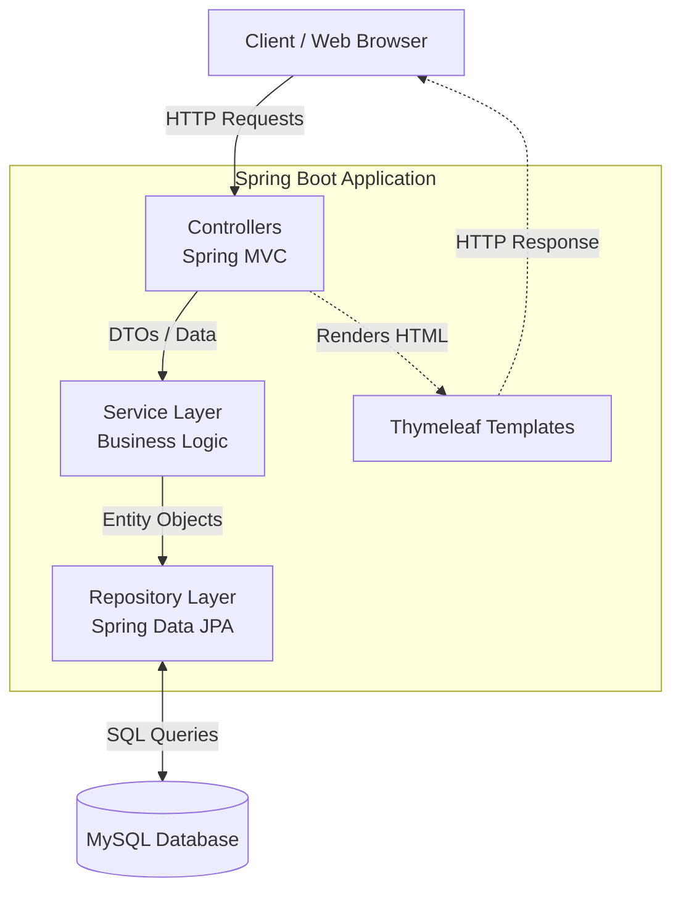

# Job Portal Management System - Project Overview

This document provides a comprehensive technical overview of the Job Portal Management System, detailing the technology stack, system architecture, and the step-by-step working flow of the application.

---

## 1. Technology Stack

The application is built using a robust, modern Full-Stack Java ecosystem, ensuring high performance, security, and scalability.

### **Frontend (Presentation Layer)**
*   **HTML5 & CSS3:** For structuring and styling the web pages.
*   **Thymeleaf:** A modern server-side Java template engine for web environments. It dynamically renders HTML data sent from the Spring Boot backend before sending the final page to the client's browser.
*   **JavaScript:** For client-side interactivity and minor DOM manipulations.

### **Backend (Business Logic Layer)**
*   **Java 21:** The core programming language used for backend development.
*   **Spring Boot (v3.5+):** The primary framework used to simplify the setup and development of the application.
    *   **Spring MVC:** Handles web requests, routing, and RESTful principles.
    *   **Spring Security:** Provides comprehensive security services, specifically authentication (verifying who the user is) and authorization (verifying what the user can do via Role-Based Access Control).
    *   **Spring Boot Starter Mail:** Integrates JavaMailSender for sending OTPs and password recovery emails via an external SMTP server (e.g., Gmail).

### **Database (Data Access Layer)**
*   **MySQL:** A highly reliable relational database management system (RDBMS) used to store user profiles, roles, job postings, and application records.
*   **Spring Data JPA (Hibernate):** Used for Object-Relational Mapping (ORM). It eliminates the need for manual JDBC SQL queries by mapping Java Objects (Entities) directly to MySQL database tables.

### **Build & Build Tools**
*   **Maven:** Used for project dependency management and build automation.

---

## 2. Architecture Flow

The system strictly follows the **3-Tier Architecture** pattern, ensuring a clean separation of concerns.

1.  **Presentation Tier (Client/View):** The user interacts with the Thymeleaf-generated HTML pages in their browser.
2.  **Application Tier (Controllers & Services):** 
    *   **Controllers** intercept the incoming HTTP requests (e.g., `/login`, `/jobs/apply`), validate inputs, and pass data to the Service layer.
    *   **Services** contain the core business logic (e.g., verifying an OTP, checking if a student has already applied for a specific job).
3.  **Data Tier (Repositories & Database):** **Repositories** (extending `JpaRepository`) take instructions from the Service layer and automatically translate them into SQL commands to fetch, save, or update records in the **MySQL database**.

---

## 3. Working Flow

The system handles different workflows based on the user's assigned role (`ROLE_STUDENT`, `ROLE_EMPLOYER`, `ROLE_ADMIN`).

### A. Authentication & Security Flow
1.  **Registration:** A new user fills out the registration form. Passwords are immediately encrypted using BCrypt before being saved to the database.
2.  **Role Assignment:** The system automatically maps the user to a default role (usually `ROLE_STUDENT`) in the `users_roles` database table.
3.  **Login:** The user submits their credentials. Spring Security intercepts the request, checks the BCrypt hash in the database, and establishes a secure session.
4.  **Forgot Password (OTP):** If a user forgets their password, they enter their email. The system generates a secure OTP, saves it temporarily, and uses Spring Mail to send it to their inbox. Upon correct OTP entry, the password can be reset.

### B. Employer Flow
1.  **Dashboard Access:** Once logged in as `ROLE_EMPLOYER`, the user is directed to the Employer Dashboard.
2.  **Post a Job:** The employer fills out a form detailing the Job Title, Description, Requirements, and Salary. This data is saved to the `Jobs` table in MySQL.
3.  **Manage Applications:** The employer can click on their active job postings to view a list of students who have applied, accessing the applicants' profile details and contact information.

### C. Student Flow
1.  **Job Discovery:** Upon logging in, a `ROLE_STUDENT` user is directed to the Job Feed.
2.  **Browsing:** Students can scroll through all active job postings created by various employers.
3.  **Application:** The student clicks "Apply" on a specific job. The system checks the database to ensure they haven't applied already. If not, a new record is created in the `Applications` table linking the `Job_ID` and the `User_ID`.

### D. Administrator Flow
1.  **Oversight:** The `ROLE_ADMIN` bypasses standard restrictions and has a macroscopic view of the platform.
2.  **Management:** Admins can view all registered users, oversee all job postings, and manage platform health, ensuring no inappropriate content is posted and resolving user role conflicts if necessary.
